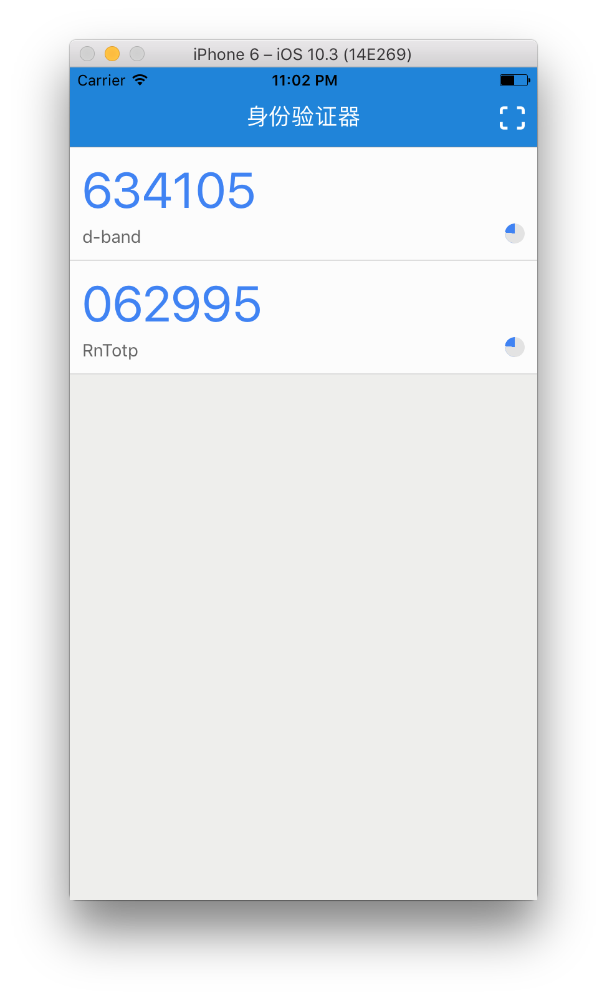

RnTotp
======

- `yax`
- `botp`
- `react@16.0.0-alpha.6`
- `react-native@0.43.3`
- `react-native-camera`
- `react-native-router-flux`
- `react-native-simple-store`
- `react-native-swipeout`
- `react-native-vector-icons`
- `react-redux`

## Screenshot

